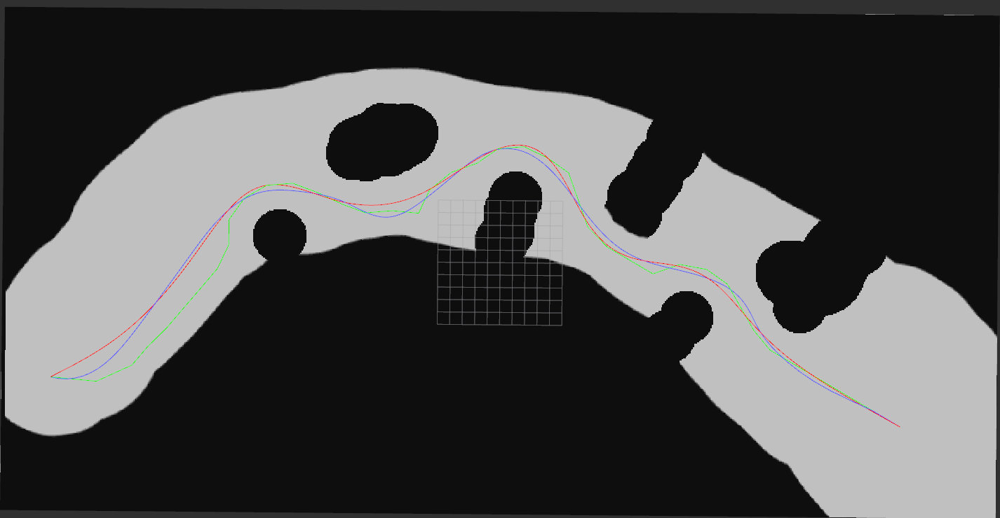

# Path Smoothing
This package is for path smoothing. I'm trying to reproduct the [conjugate gradient method](http://xueshu.baidu.com/usercenter/paper/show?paperid=b5778bb39c6db872ad2e507f3a14b23f&site=xueshu_se) and the [Gauss Process method](https://github.com/gtrll/gpmp2). The latter considers vehicle kinematics but is unstable now.

## Demo Result

the red curve is the result of CG method and the blue curve is the result of GPMP.

## Dependency
* [ceres-solver](https://github.com/ceres-solver/ceres-solver) is required for solving Conjugate Gradient method.
* [cppad](https://coin-or.github.io/CppAD/doc/cppad.htm) and [casadi](https://github.com/casadi/casadi) are two necessary Automatic  Differentiation tools.
* [grid_map](https://github.com/ANYbotics/grid_map) is necessary for obstacle consideration.
* [gtsam4.0](https://bitbucket.org/gtborg/gtsam), [gpmp2](https://github.com/gtrll/gpmp2) are optional.
[rosparam_handler](https://github.com/cbandera/rosparam_handler), [dynamic_reconfigure](http://wiki.ros.org/dynamic_reconfigure) are used for demo.

## Test
* test path smoothing without obstacle
````
rosrun path smoothing without obstacle
cd <path_smoothing-package-dir>/demo
python simple_curve_plot.py
````
* test path smoothing with obstacle
````
roslaunch path_smoothing smooth_with_obstacle_demo.launch
````

